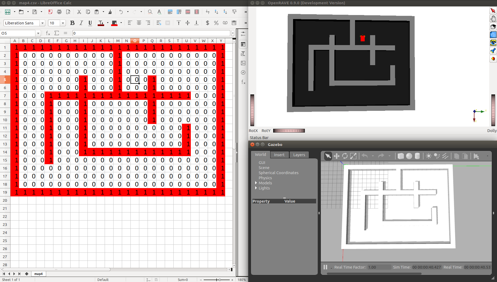

# map4

Coordinates in [map4.csv](map4.csv) coordinates, file indices starting at 1,1:
- Origin: Line 5, Column 15. At resolution 1 pixel/meter = 1 meter/pixel: X = 4.5 m, Y = 14.5 m
- Destiny: Line 5, Column 11. At resolution 1 pixel/meter = 1 meter/pixel: X = 4.5 m, Y = 10.5 m

