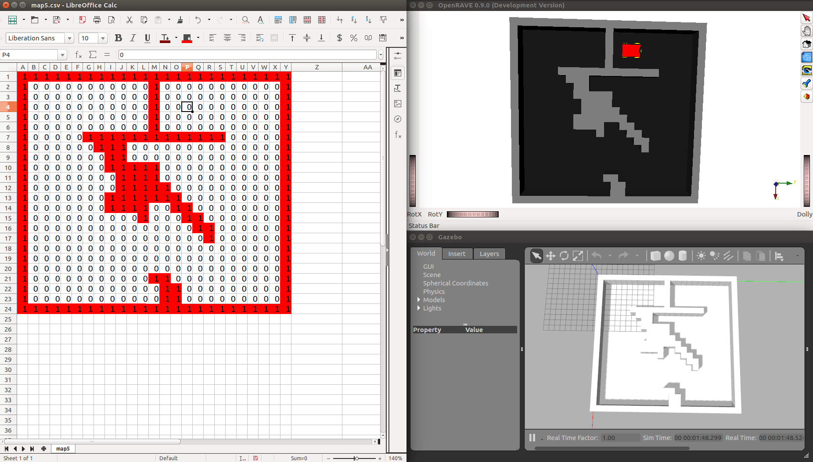

# map5

Coordinates in [map5.csv](map5.csv) coordinates, file indices starting at 1,1:
- Origin: Line 4, Column 16. At resolution 2 pixel/meter = 0.5 meter/pixel: X = 1.75 m, Y = 7.75 m
- Destiny: Line 4, Column 10. At resolution 2 pixel/meter = 0.5 meter/pixel: X = 1.75 m, Y = 4.75 m

