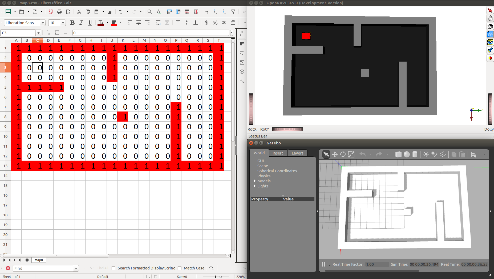

# map8

Coordinates in [map8.csv](map8.csv) coordinates, file indices starting at 1,1:
- Origin: Line 3, Column 3. At resolution 1 pixel/meter = 1 meter/pixel: X = 2.5 m, Y = 2.5 m
- Destiny: Line 11, Column 18. At resolution 1 pixel/meter = 1 meter/pixel: X = 10.5 m, Y = 17.5 m

